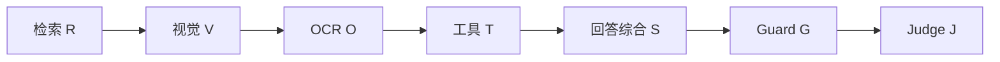
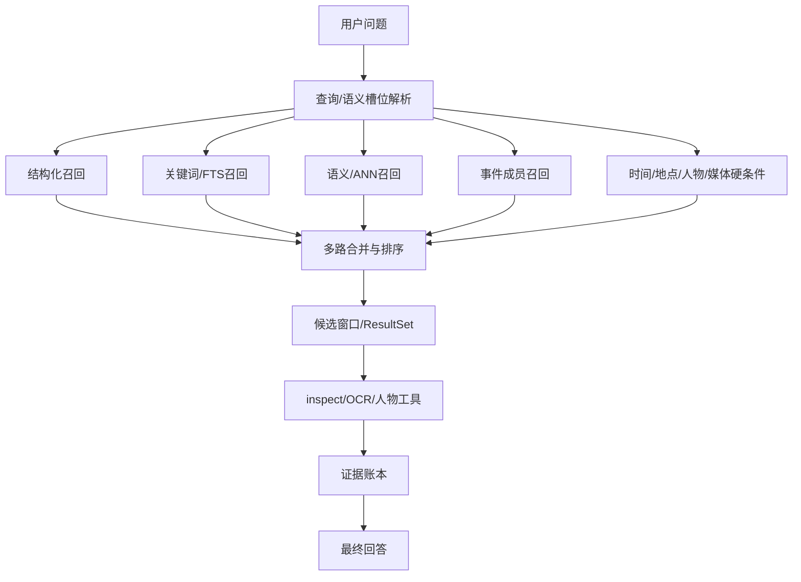
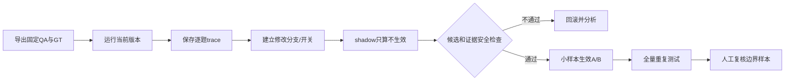
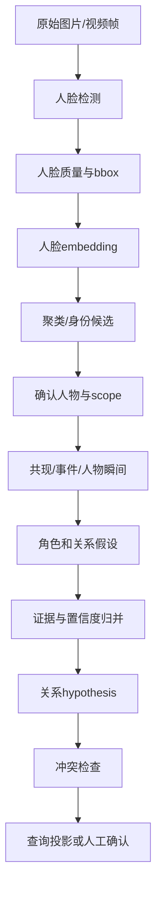
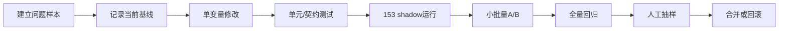

# 记忆查询架构与图关系建立：代码优化调试方法

本文只说明如何分析、修改、调试和验收，不直接提供优化实现代码。适用对象是 153 上的 Sentrix 生产工程和本仓库的 PhotoBench 测评工程。

## 1. 通用调试原则

### 1.1 先固定实验边界

每次调试必须记录：

- Git commit、分支和工作区是否干净；
- Sentrix 服务版本、模型名、模型量化、GPU；
- 相册、scope、QA 集合、QA 版本和 manifest SHA-256；
- Judge 模型、提示词版本和评分规则；
- 并发、超时、重试、缓存冷/热状态；
- 修改前后的配置差异。

优化检索架构和优化图关系建立不能在同一批实验中同时改变，否则无法判断收益来源。

### 1.2 统一问题归因

建议把失败归入以下层级：



- `R`：GT 没有进入候选集；
- `V`：候选正确，但图片观察错误；
- `O`：文字读取错误或未触发 OCR；
- `T`：工具选择、参数或调用顺序错误；
- `S`：证据正确但最终回答综合错误；
- `G`：预算、状态、引用或安全约束导致回答异常；
- `J`：Judge 服务或评分口径问题。

没有先定位层级，就不要直接调阈值或换模型。

### 1.3 记录完整证据链

每条失败 QA 至少保存：用户问题、scope、query/filter、模型规划结果、每个检索通道候选、最终候选窗口、GT 资产、工具输入输出、回答、Judge 结果和耗时。只保存最终回答无法判断是召回错还是回答错。

## 2. 记忆查询架构的调试方法

### 2.1 153 当前链路

153 当前 `search_memories` 的主要逻辑可按下图检查：



调试时不要只看“检索结果数量”，要逐层确认：

1. 槽位解析是否丢掉了时间、地点、人物或事件；
2. 空 query 是否错误地走了语义召回；
3. 结构化通道是否正确执行了硬条件；
4. 关键词通道是否受到分词、中文短词或 FTS 配置影响；
5. ANN 通道的模型版本、向量空间和 scope 是否一致；
6. 事件召回是否把“属于事件”误当成“与问题相关”；
7. 合并排序是否让低相关候选挤掉 GT；
8. 预览窗口是否因去重或多样性策略隐藏了 GT；
9. ResultSet、preview、inspect 使用的 asset handle 是否来自同一次查询；
10. 证据账本是否记录了回答实际使用的资产。

### 2.2 典型问题与定位方法

| 问题 | 观察信号 | 定位顺序 |
|---|---|---|
| GT 完全未召回 | Recall@K 为 0，所有通道都没有 GT | 先查 scope、时间、地点硬过滤，再查槽位和各通道原始结果 |
| 原始结果有 GT，但预览没有 | retrieved IDs 有 GT，preview 无 GT | 查候选窗口、事件多样性、断层截断和 preview 排序 |
| 跨相册串结果 | candidate 的 scope 与题目不同 | 查 scope 传递、缓存 key、ResultSet 归属和数据库查询条件 |
| 时间题命中错误年份 | time filter 缺失或边界不一致 | 对比问题、槽位 bounds、数据库 captured_at、最终过滤条件 |
| 关键词检索中文失效 | 仅 ANN 命中，lexical 为空 | 查规范化、分词、FTS 索引刷新、中文短词策略 |
| 多路结果重复 | duplicate rate 上升，证据数异常 | 以 asset_id 去重，同时保留通道 provenance，检查视频 keyframe 映射 |
| 检索正确但回答错误 | GT 在候选和 inspect 中，Judge 仍判错 | 转入 V/S/T 层，不要继续调召回阈值 |
| 多轮问题串上下文 | 第二轮引用上一轮不相关图片 | 查 result_set_id、翻页规则、scope 和用户指代解析 |

### 2.3 记忆查询 A/B 修改流程



推荐分阶段修改：

1. 先改 trace 和数据统计，不改变候选；
2. 再改单个召回通道；
3. 再改融合排序；
4. 最后改候选窗口和缓存；
5. 每一阶段都保留旧结果，不能用新结果覆盖基线。

### 2.4 记忆查询测试集设计

至少覆盖以下题型：

| 类别 | 样例特征 | 重点检查 |
|---|---|---|
| 结构化事实 | 时间、数量、媒体类型 | 是否绕过不必要 ANN，结果是否完整 |
| 时间过滤 | 去年、某月、时间段 | 边界、时区、缺失时间 |
| 地点过滤 | 城市、景点、GPS 反向地理编码 | 地名别名和硬过滤回退 |
| 人物查询 | 已确认人物、多人 | entity scope、交集/并集逻辑 |
| 视觉语义 | 衣着、颜色、物体、活动 | 召回与 inspect 分工 |
| OCR | 菜单、招牌、数字 | OCR 是否在候选正确后触发 |
| 多轮引用 | “上一组”“那次旅行” | ResultSet 和事件锚点 |
| 空结果/拒答 | 不存在的时间、人物或内容 | 不得编造候选和答案 |
| 视频 | keyframe、时间戳、混合媒体 | parent asset、scene index、证据映射 |

### 2.5 记忆查询指标

- `Recall@K = 命中的 GT 资产数 / GT 资产总数`；
- `Precision@K = 命中的 GT 资产数 / 返回候选数`；
- `MRR`：第一个 GT 候选排名倒数的平均值；
- `nDCG@K`：有相关性等级时评价排序质量；
- `evidence coverage`：回答所需证据是否进入候选和证据账本；
- `duplicate rate`：同一资产、同一视频帧或同一证据重复出现的比例；
- `contradiction rate`：硬条件过滤后仍存在冲突候选的比例；
- `p50/p95 retrieval latency`：只统计检索，和模型、Judge、图片分析分开；
- `cache hit ratio`：分冷缓存和热缓存报告。

正式验收建议：Recall 不下降，Precision 不下降超过 2 个百分点，evidence coverage ≥ 0.95，duplicate rate ≤ 0.01，且 p95 检索时延不增加 20%。这些是建议门槛，需要结合当前 baseline 调整。

## 3. 图关系建立的调试方法

### 3.1 当前关系链路

153 的人物/图关系建立应按以下链路检查：



对应 153 代码重点包括 `face_detector.py`、`face_embeddings.py`、`face_clustering.py`、`person_moments.py`、`person_graph.py`、`pipeline.py` 和 `db.py`。

### 3.2 分层检查清单

#### 人脸检测层

- bbox 是否越界、过小、重复或落在错误视频帧；
- 低清、遮挡、侧脸是否被标记为低质量；
- 同一张图片的人脸数量是否和 QA/人工抽样一致；
- 检测模型名称和版本是否被记录。

#### embedding/聚类层

- 所有向量是否使用同一个模型和版本；
- 归一化、维度和相似度计算是否一致；
- 阈值改变后分别观察误合并和误拆分；
- 低质量人脸是否形成 bridge，把不同人物串到同一 cluster；
- 聚类结果是否稳定，输入顺序改变后是否产生不同 ID。

#### 人物和事件层

- cluster 是否正确映射到 person/entity；
- person、face、asset、observation、event 是否属于同一个 scope；
- 同一人物多张照片是否拥有足够独立证据；
- 人物瞬间的 interaction target 是否确实出现在同一张图；
- 视频 keyframe 是否错误继承 parent asset 的人物或事件。

#### 关系边层

- 对称关系是否只保留一条规范边；
- 方向关系的 inverse predicate 是否正确；
- self-loop、未知人物、跨 scope 关系是否被拒绝；
- 每条关系能否追溯到 asset、observation、event 或 moment；
- 关系置信度是否来自独立证据，而非重复写入同一证据；
- 父亲/母亲/孩子等冲突关系是否进入人工复核，而不是直接成为 confirmed fact；
- revision、supersedes 和 status 是否能恢复历史状态。

### 3.3 图关系问题与定位

| 问题 | 典型表现 | 优先检查 |
|---|---|---|
| 两个人被合成一个人 | cluster 过大、pairwise precision 下降 | 低质量 bridge、阈值、pose bucket、embedding 版本 |
| 同一个人被拆成多人 | pairwise recall 下降、singleton 上升 | 阈值过高、光照/侧脸、原型覆盖 |
| 关系边重复 | A-B 与 B-A 同时存在 | 对称关系归一、唯一键、写入重试 |
| 关系无证据 | 页面有关系但无法定位照片 | evidence IDs、event/moment 绑定、scope 传递 |
| 家庭关系过度推断 | 朋友/访客被推成亲属 | 关系候选门槛、冲突检查、unknown 保留 |
| 新照片未更新关系 | 全量重跑才出现新边 | 增量触发、受影响 entity/event 计算、revision |
| 冲突关系同时生效 | 同一对人物有相反家庭关系 | conflict 标记、confirmed 投影过滤、人工复核 |

### 3.4 图关系 A/B 调试流程

1. 固定 face detector、embedding 模型和版本，只比较关系构建逻辑；
2. 使用同一批图片和同一批人脸实例，避免重新检测造成干扰；
3. 导出旧版和新版 cluster、person mapping、relation edges 及证据 ID；
4. 先做 pairwise identity 对比，再做关系边对比；
5. 按关系类型分别统计，不要用总 F1 掩盖某一种关系的退化；
6. 对高置信、低置信、冲突、单证据、新增照片各抽样人工复核；
7. 通过后再将新关系写入 suggested 投影，确认稳定后才进入 confirmed 查询投影；
8. 保存旧版关系表或快照，出现误合并时可以按 revision 回滚。

### 3.5 图关系指标

- 人脸检测 Precision/Recall；
- identity pairwise Precision/Recall/F1；
- cluster singleton ratio、误合并率、误拆分率；
- relation edge Precision/Recall/F1；
- 分关系类型的 F1，例如朋友、配偶、亲子、共现；
- `duplicate edge rate`：同一规范边的重复比例，目标为 0；
- `conflict rate`：被冲突检查标记的边比例；
- `evidence traceability`：可回溯到原始证据的 confirmed 边比例，目标为 1；
- 增量更新耗时与全量重建耗时；
- confirmed 边误报率，优先级高于 suggested 召回率。

## 4. 推荐的代码调试工作流

虽然本文不直接提交优化代码，但实际修改时建议遵守以下 Git 流程：



每次提交至少附带：

- 修改目标和不变条件；
- 受影响的 QA 集合；
- 修改前后指标；
- 失败样本链接或 run ID；
- 数据库/索引迁移说明；
- 回滚方式；
- 是否改变模型、提示词、并发或数据版本。

## 5. 153 实验访问与结果保存

153 数据目录和服务入口：

```text
PhotoBench面板: http://192.168.0.153:8771/
Sentrix服务:   http://192.168.0.153:8091
SSH用户:       asus@192.168.0.153
QA/manifest:   /home/asus/Github/Sentrix-Home-Web/services/photobench/data
原始相册:      /home/asus/album3-max
```

面板 API 示例：

```bash
curl http://192.168.0.153:8771/api/manifests
curl 'http://192.168.0.153:8771/api/qa-dataset?album_id=album3-14&qa_set=compact'
```

实验结果必须保存 run ID、commit、manifest、scope、模型和 Judge 配置。账号密码不写入脚本、日志、文档或 Git；原始媒体和数据库只留在受控机器上。
