# PhotoBench 测评项目介绍与系统使用说明

## 1. 项目定位

本项目文档对应的 Sentrix Home 工程分为三部分：算法服务、前端主界面和测试平台。三者共同组成“数据处理—记忆展示—测评验证”的完整链路。

项目地址：<https://github.com/yuxi1996/sentrix-home-test>

前端主界面访问地址：<http://192.168.0.200:4174/#/search>

测评平台：<http://192.168.0.153:8771/>

最新算法服务：`http://192.168.0.153:8091`

| 部分 | 主要职责 | 当前访问/代码位置 |
|---|---|---|
| 算法服务 | 媒体导入、图片/视频分析、Embedding、人脸聚类、事件、记忆查询、实体和关系 | 153 最新服务 `8091`；代码为 `/home/asus/Github/Sentrix-Home-Web/backend/`、`scripts/` |
| 前端主界面 | 实际记忆相册、家庭记忆对话、事件时间线、人物与关系、实体知识、资料库和故事展示 | 最新代码为 153 `/home/asus/Github/Sentrix-Home-Web/src/`；当前可访问地址为 200 `4174`，153 也提供 `4174/5173` |
| 测试平台 | 选择 QA、模型和运行模式，执行 Agent/Judge，保存逐题结果和指标 | 153 `8771`；代码为 `/home/asus/Github/Sentrix-Home-Web/services/photobench/` |

本仓库主要负责测评编排和结果展示；153 算法工程负责记忆处理，不替代模型训练。一次完整测评通常包含：

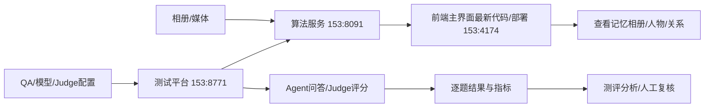

### 1.1 三部分之间的关系

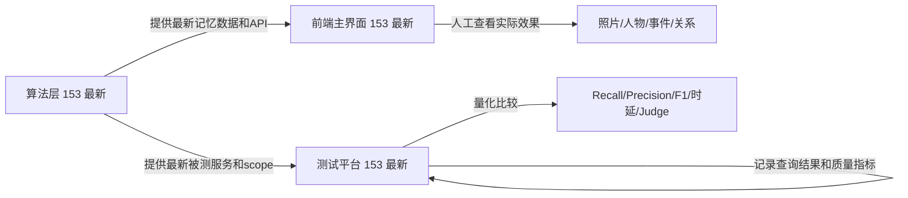

因此，优化调试不能只看 153 测试平台的分数：应在最新前端主界面确认照片、人物、事件和关系确实发生了预期变化，再用 153 测试平台确认变化没有造成整体质量退化。最新代码、算法、前端和测试平台均以 153 为准；200 的 4174 仅作为当前访问入口，需确认其部署内容与 153 最新版本一致。

## 2. 工程目录

| 目录/文件 | 作用 |
|---|---|
| `backend/benchmark_orchestrator.py` | 测评服务入口、运行编排、数据加载、结果保存、Judge 调用和 API |
| `backend/runtime_providers.py` | OpenAI-compatible 模型端点、Manager 和运行时遥测适配 |
| `frontend/src/` | Vue 3 面板源码 |
| `frontend/dist/` | 面板生产构建文件 |
| `config/` | Judge、运行服务和 vLLM 目标配置模板 |
| `data/` | manifest、QA 定义和可提交的数据集元信息；原始媒体不上传 |
| `results/` | 本地历史测评结果，不进入 Git |
| `logs/` | 本地服务日志，不进入 Git |
| `tests/` | 测评编排、图片证据提取、结果契约等回归测试 |
| `scripts/start.sh` / `scripts/stop.sh` | 启停 8771 服务 |

## 3. 前端主界面与测试平台功能总览

项目有两个需要区分的界面和一个算法服务：Sentrix Home 是实际产品主界面，153 的 `8091` 是最新算法服务，153 的 `4174/5173` 是最新主界面运行端口，153 的 `8771` 是最新测试平台。

### 3.1 前端主界面：记忆相册和家庭记忆

最新主界面代码和运行版本在 153。当前访问地址可以是：

- 153：<http://192.168.0.153:4174/#/search>；开发端口 <http://192.168.0.153:5173/#/search>；
- 200：<http://192.168.0.200:4174/#/search>，作为现有访问入口，需确认已同步 153 最新版本。

主界面导航包括：

| 页面 | Hash 路径 | 主要功能 |
|---|---|---|
| 家庭概览 | `#/overview` | 当前相册统计、事件、事实和本地 AI 状态 |
| 家庭记忆助手 | `#/search` | 通过自然语言查询人物、地点、事件和照片，并查看证据 |
| 事件时间线 | `#/timeline` | 按日期查看事件、照片、视频场景和事件证据 |
| 人物与关系 | `#/people` | 查看人物卡片、待确认人脸簇、人物证据和家庭关系图 |
| 实体与知识 | `#/knowledge` | 查看人物画像、语义实体、地点/物品和事实 |
| 资料库 | `#/library` | 浏览当前相册的真实 Asset，按图片/音频/文本/视频筛选 |
| 故事工作室 | `#/stories` | 基于已确认事件生成和维护故事草稿 |
| 导入队列 | `#/imports` | 查看媒体导入、元数据读取和处理进度 |
| 视频分析性能 | `#/performance` | 查看视频场景和分析性能 |
| 设备与隐私 | `#/settings` | 查看设备、模型、隐私和运行设置 |

记忆查询架构和图关系优化后的效果，优先在 153 最新主界面的 `#/search`、`#/library`、`#/timeline`、`#/people` 和 `#/knowledge` 查看。

### 3.2 测试平台：PhotoBench

打开：<http://192.168.0.153:8771/>

测试平台的主要功能模块如下：

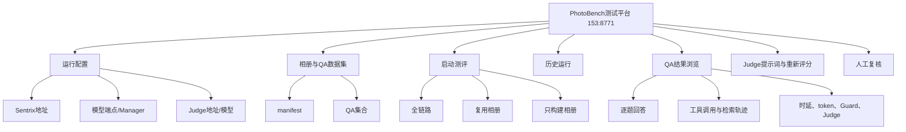

### 3.3 记忆相册查看能力说明

记忆查询和图关系优化的效果必须能回到具体照片、人物和证据上查看。目前面板提供以下查看路径：

| 查看内容 | 当前入口 | 说明 |
|---|---|---|
| 相册是否已经构建 | 200 主界面“家庭概览/资料库”；153 测试平台“构建相册/复用相册” | 查看已有 memory space/scope 和处理状态 |
| 完整记忆相册 | 153 最新主界面 `#/library` | 浏览真实 Asset，按媒体类型筛选，打开原图、视频和处理详情 |
| 事件记忆 | 153 最新主界面 `#/timeline` | 查看事件时间、地点、照片、视频场景和原始证据 |
| 人物和关系 | 153 最新主界面 `#/people`、`#/knowledge` | 查看人物样本、实体画像、关系图和待确认关系 |
| 自然语言查询 | 153 最新主界面 `#/search` | 查看回答、检索到的照片、证据和查询过程 |
| QA 对照照片 | QA 数据集审阅 | 查看题目的检索 GT、直接证据和视频证据 |
| 实际检索结果 | 历史运行 → 逐题详情 | 查看 retrieved media、preview、predicted/evidence media |
| 检索过程 | 历史运行 → 工具调用/检索轨迹 | 查看 query、候选、工具顺序、证据账本和耗时 |
| 测评量化结果 | 153 测试平台历史运行 | 查看 Recall、Precision、F1、Judge、token、时延和失败归因 |

153 最新主界面已经提供记忆相册的实际查看入口，尤其是 `#/library` 资料库、`#/timeline` 事件时间线、`#/people` 人物与关系和 `#/knowledge` 实体与知识。153 的 `8091` 提供最新算法，153 的 `8771` 负责测评。200 的 `4174` 是现有访问入口，但查看最新效果时应先确认其前端和后端均已同步 153 版本；最稳妥的方式是直接使用 153 主界面。

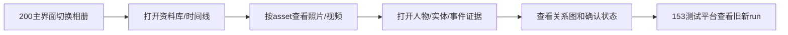

### 3.4 测试平台运行配置

用于填写或检查：

- Sentrix 算法服务 API 地址，最新版本对应 `http://192.168.0.153:8091`；测试时以面板实际配置为准；
- 模型服务地址或 vLLM Manager 地址；
- 当前服务模型名称；
- Judge 地址、模型和提供商配置；
- 模型切换、GPU 采样和运行时状态。

生产测评应使用模型 Manager 进行受控冷切换。若直接使用一个外部 OpenAI-compatible 端点，应明确记录没有 Manager 生命周期和硬件遥测，不能把 `not_applicable` 当作测评失败。

### 步骤二：选择数据集

面板从 manifest 读取相册信息，从 QA JSONL 读取问题、参考答案、检索 GT、人物引用、事件和多轮对话信息。选择相册后，应确认：

1. QA 集合名称正确；
2. 题目数量与 manifest 记录一致；
3. 媒体路径可由 Sentrix 解析；
4. 检索 GT 的媒体 ID 与当前相册一致；
5. 多轮题目的 turn 顺序没有变化。

### 3.5 三种运行模式

| 模式 | 用途 | 是否新建相册 | 是否导入/处理媒体 | 是否执行 QA |
|---|---|---:|---:|---:|
| 全链路测试 `full` | 验证从建库到回答的完整流程 | 是 | 是 | 是 |
| 复用相册 `reuse` | 固定已有相册，专门比较模型或 Agent | 否 | 否 | 是 |
| 构建相册 `build` | 只验证导入、索引、身份和流水线 | 是 | 是 | 否 |

推荐使用顺序：先 `build` 验证数据入库，再 `reuse` 做模型/架构 A/B，最后用 `full` 验证完整交付链路。

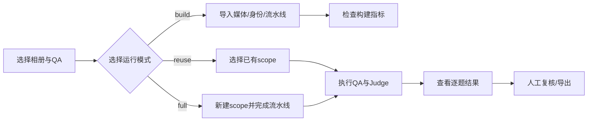

## 4. 推荐的面板操作流程

### 步骤一：检查服务

测试平台浏览器打开：

```text
http://192.168.0.153:8771/
```

命令行检查：

```bash
curl http://192.168.0.153:8771/api/manifests
curl http://192.168.0.153:8771/api/health
```

如果面板能打开但模型列表为空，先检查模型服务地址、Manager 地址和网络连通性，不要直接启动正式测评。

实际记忆相册主界面打开：

```text
http://192.168.0.200:4174/#/search
```

如果要直接看相册资料库，可打开：

```text
http://192.168.0.200:4174/#/library
```

### 步骤二：选择数据集

优先从已有 manifest 选择相册和 QA 集合。153 当前常用数据规模如下：

| 相册/数据集 | QA 集合或数量 |
|---|---|
| `album3` | compact 10、full 38、behavior 6、paraphrase 88、OCR 8 |
| `album3-14` | compact 10、behavior 6 |
| `album3-kling` | compact 10、full 38、behavior 6、paraphrase 88、OCR 8 |
| `album3-max` | 总计 100；answerable 70、clarify 11、refuse 19 |
| `album3-max-video10` | image-related 439、single-video 48、mixed 487 |

也可以直接查看 QA API：

```bash
curl 'http://192.168.0.153:8771/api/qa-dataset?album_id=album3&qa_set=compact'
```

### 步骤二补充：查看记忆相册和实际入库资产

先在 200 主界面左侧的“当前相册”下拉框选择“全部相册”或具体相册，再打开“资料库”；也可以在 153 测试平台的“复用相册”中加载已有 memory space，记录 `scope_id`。通过接口获取 scope 列表：

```bash
curl 'http://192.168.0.153:8091/api/memory-spaces?limit=1000'
```

再查询该 scope 的资产：

```bash
curl 'http://192.168.0.153:8091/api/assets?scope_id=<SCOPE_ID>&limit=2000'
```

单个照片或视频资产可通过返回的 `asset.id` 查看：

```text
http://192.168.0.153:8091/api/assets/<ASSET_ID>/file
```

主界面中的实际查看路径：

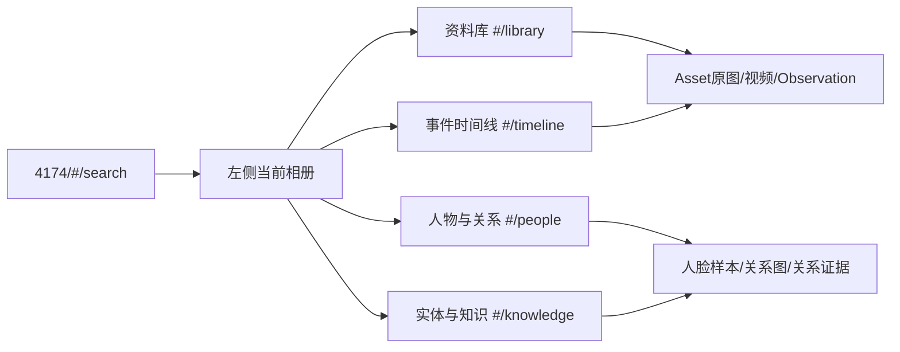

查看优化效果时，至少保存以下字段：

- `asset_id`、`file_name`、`media_type`、`captured_at`；
- observation 的描述、地点、人物和事件引用；
- 人脸实例、person/entity、cluster 的映射；
- 关系边的 subject、predicate、object、status、confidence 和 evidence；
- 查询返回的 retrieved asset、preview asset、evidence asset；
- 新旧 run 的 query、scope、候选排名和最终回答。

### 步骤二补充：通过两个界面看出优化前后差异

使用 200 主界面查看同一 scope 的实际记忆数据，再在 153 测试平台使用同一相册和同一 QA 集合分别运行旧版本和修改版本。推荐使用“复用相册”模式，避免重复导入和流水线处理：

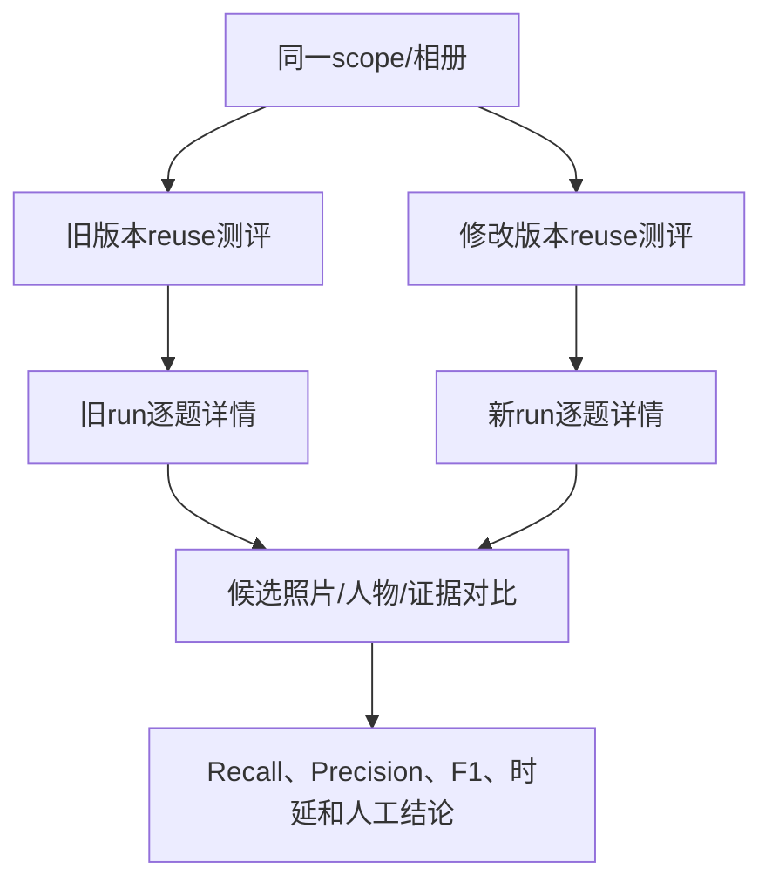

逐题对比顺序：

1. 先对比 GT 是否进入 retrieved asset；
2. 再对比 preview 是否展示正确照片；
3. 再对比 inspect/OCR/人物工具是否使用了正确 asset handle；
4. 再对比证据账本是否引用同一批照片；
5. 图关系题再对比人物 cluster、关系边和 evidence ID；
6. 最后对比最终回答、Judge、时延和 token。

如果只看最终分数而不看照片和证据，无法判断优化究竟改善了召回、排序、人物识别还是回答生成。

### 步骤三：启动运行

启动前固定并记录：

- 模型名称和量化方式；
- Sentrix 地址和版本；
- Judge 地址、模型和提示词版本；
- 相册、QA 集合、运行模式；
- Agent/Judge 并发；
- 是否复用已有 scope；
- 是否删除构建产物。

同一组 A/B 测试只能改变一个变量。例如比较记忆查询架构时，模型、相册、QA、Judge、并发和 scope 都要保持不变。

### 步骤四：查看运行阶段

运行阶段通常包括：

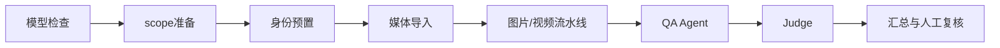

阶段异常时先看结构化阶段状态和错误详情，再看日志。日志只用于定位服务异常，不能用日志文本推测缺失的评测指标。

### 步骤五：查看结果

结果页面建议按以下顺序查看：

1. 总体完成数和失败数；
2. exact/core/Judge 质量；
3. 检索 Recall、Precision、F1 和 GT 命中；
4. JSON 解析、任务判断、预算内完成率；
5. TTFT、模型总时延、token/s、工具耗时和端到端耗时；
6. Agent 状态、终止原因、Guard 恢复；
7. 逐题回答、工具调用、检索预览、证据账本；
8. 人工复核 verdict 和备注。

历史结果通过分页加载：

```text
GET /api/runs
GET /api/runs/{run_id}
GET /api/runs/{run_id}/items?page=1&page_size=20
GET /api/runs/{run_id}/items/{index}
GET /api/runs/{run_id}/judge-prompt
GET/POST /api/runs/{run_id}/reviews
```

逐题查看时重点确认“检索到的资产”与“回答引用的证据”是否一致，不能只看最终文字是否通顺。

## 5. 153 最新工程与各服务访问方式

153 上的最新工程统一位于：

```text
/home/asus/Github/Sentrix-Home-Web
```

三部分代码位置：

```text
backend/                    # 最新算法服务
src/                        # 最新前端主界面
services/photobench/        # 最新测试平台
```

153 最新算法服务访问：

```bash
ssh asus@192.168.0.153
cd /home/asus/Github/Sentrix-Home-Web
curl http://127.0.0.1:8091/api/health
```

153 最新前端主界面访问：

```text
http://192.168.0.153:4174/#/search
http://192.168.0.153:5173/#/search   # 开发端口
```

你提供的 200 主界面地址仍可访问：

```text
http://192.168.0.200:4174/#/search
```

但 200 地址只是现有访问入口，最新代码、算法和页面版本以 153 仓库和 153 运行服务为准。正式查看优化效果时，优先使用 153 的主界面；若使用 200 地址，必须先确认它已经同步 153 最新前端并连接 153 的 `8091` 算法服务。

153 上的测试工程和数据目录：

```text
/home/asus/Github/Sentrix-Home-Web/services/photobench/data
/home/asus/album3-max
/home/asus/photobench-e2e
/home/asus/benchmarks
/home/asus/sentrix-benchmarks/photobench-face-ab-20260823
/home/asus/data/photobench-face-ab-20260823
/home/asus/data/photobench-validation-1184
/home/asus/data/household-benchmark-max
```

SSH 访问：

```bash
ssh asus@192.168.0.153
cd /home/asus/Github/Sentrix-Home-Web/services/photobench
find data -maxdepth 2 -type f
```

153 测试平台访问：

```text
http://192.168.0.153:8771/
```

200 主界面访问：

```text
http://192.168.0.200:4174/#/search
http://192.168.0.200:4174/#/library
http://192.168.0.200:4174/#/people
http://192.168.0.200:4174/#/knowledge
http://192.168.0.200:4174/#/timeline
```

账号密码只通过安全渠道提供，不写入本文、配置文件或 Git。原始照片、视频、数据库和 API Key 不应上传到公开仓库。

## 6. 当前 153 基线记录

已核对的 153 运行基线：

- run：`20260831-141104-album3-14-gemma4-12b-it-reuse-0e0886`；
- 10/10 完成，Judge 10 条有效；
- answer quality `1.0/2`，exact `0.4`，core `0.6`；
- retrieval Precision/Recall/F1：`0.710 / 0.880 / 0.786`；
- task decision `0.800`，JSON parse `0.929`，within steps `1.000`；
- TTFT `573.9 ms`，token/s `17.5`，E2E mean `66.5 s`；
- agent throughput `0.128 QA/s`，平均 loop `6.4`；
- 工具 p50：`search_memories 11.6 s`、`inspect_photo 4.29 s`、`query_photo_people 10 ms`。

以上是已有实测记录，不代表后续架构优化已经在 153 生效。

## 7. 常见问题处理

| 现象 | 优先检查 |
|---|---|
| 面板打不开 | 8771 进程、端口、防火墙、浏览器访问地址 |
| 相册为空 | manifest 路径、Sentrix 地址、scope 权限 |
| QA 数量不一致 | QA 集合、JSONL、manifest、题目过滤条件 |
| 模型列表为空 | Manager 地址、模型服务 `/v1/models`、网络 |
| 全部题目失败 | Sentrix 健康状态、模型端点、Judge 地址、请求超时 |
| 检索命中但回答错误 | 逐题查看 candidate、preview、inspect、证据账本和回答引用 |
| Judge 无结果 | Judge 服务、API 配置、并发限制和提示词版本 |
| 时延异常 | 区分模型、工具、流水线和 Judge 时延，不用总墙钟替代分项数据 |

## 7.1 当前模型测试阶段的指标设置

当前阶段首先是模型测试，因此必须把“模型能力”和“记忆系统能力”分开统计。截图中的 BFCL、BIRD、MMStar、MCPMark、EgoLife 是模型/Agent 的通用能力参考，不能直接证明记忆查询或图关系建立已经变好。

### 7.1.1 三层指标

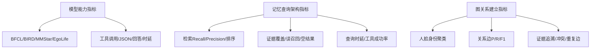

| 层级 | 当前要回答的问题 | 主要指标 | 是否用于模型排名 |
|---|---|---|---|
| 模型能力 | 哪个模型的通用推理、视觉、工具调用更强 | BFCL、BIRD、MMStar、EgoLife、JSON、TTFT、token/s | 是 |
| 记忆查询 | 同一个模型下，查询架构是否找到正确照片和证据 | Recall@K、Precision@K、MRR、nDCG、证据覆盖、误召回 | 否，作为系统分项；模型固定后比较架构 |
| 图关系建立 | 同一个模型和同一批人脸下，身份和关系是否正确 | pairwise F1、关系边 P/R/F1、冲突率、证据追溯 | 否，作为系统分项；模型固定后比较算法 |

报告中建议显示“模型总表 + 记忆查询分表 + 图关系分表”，不要把三层指标压成一个分数后只给出总排名。

### 7.1.2 记忆查询架构指标

统一使用两类候选窗口：`K=18` 表示完整检索候选，`K=6` 表示面板或模型实际可见的预览窗口。至少同时报告 Recall@18 和 Recall@6。

| 指标 | 计算方式 | 当前用途 |
|---|---|---|
| Recall@18 | 进入完整候选集的 GT 资产数 / GT 资产总数 | 判断架构有没有召回正确照片 |
| Recall@6 | 进入模型可见预览的 GT 资产数 / GT 资产总数 | 判断排序和预览是否把正确照片展示出来 |
| Precision@18 | 候选中 GT 资产数 / 候选总数 | 判断误召回和候选噪声 |
| MRR | 第一个 GT 资产排名倒数的均值 | 判断正确照片是否排在前面 |
| nDCG@18 | 按直接证据、事件相关、弱相关分级计算排序 | 判断多证据排序质量 |
| Evidence coverage | 回答需要的照片/人物/事件证据被候选和账本覆盖的比例 | 判断能否支撑最终回答 |
| No-result accuracy | 没有证据的问题是否正确返回无结果/无法确认 | 判断是否减少编造 |
| Duplicate rate | 重复 asset、视频帧或 evidence 的比例 | 判断多路召回合并质量 |
| Hard-filter violation | 时间、地点、scope 等硬条件被违反的比例 | 必须接近 0 |
| 检索 p50/p95 | 只统计 query 到候选集完成，不含 Judge | 判断架构代价 |

153 已核对的参考基线为 Retrieval Precision/Recall/F1 `0.710 / 0.880 / 0.786`。在当前模型测试阶段，候选模型至少不能让这三个检索指标相对基线下降超过 2 个百分点；架构优化阶段再以固定模型比较提升量。

建议的记忆查询验收门槛：

- Recall@18 不下降；目标是在相同模型下提升 5%；
- Recall@6 不低于 Recall@18 的 80%，避免正确照片被预览排序隐藏；
- Precision@18 不下降超过 2 个百分点；
- Evidence coverage ≥ 0.95；
- Hard-filter violation = 0；
- Duplicate rate ≤ 0.01；
- 检索 p95 不超过旧版本的 120%；
- 空结果题不得出现“找到照片”等无依据交付断言。

### 7.1.3 图关系建立指标

图关系指标必须使用人工标注或已确认关系作为 GT，不能用模型自己生成的关系作为正确答案。

| 指标 | 计算方式 | 说明 |
|---|---|---|
| Identity pairwise Precision/Recall/F1 | 人物两两“同一人/不同人”判断与 GT 对比 | 评价人脸聚类是否误合并或误拆分 |
| Cluster singleton ratio | 只有一个样本的人物簇 / 人物簇总数 | 监控过度拆分，不单独作为质量结论 |
| Relation edge Precision/Recall/F1 | `(subject, predicate, object)` 与 GT 边集合对比 | 必须按朋友、亲属、共现等类型拆分 |
| Confirmed precision | 被确认关系中真正正确的比例 | confirmed 误报优先级最高 |
| Suggested recall | 候选关系中 GT 关系被提出的比例 | 衡量候选层召回 |
| Evidence traceability | 可回溯到 asset/observation/event/moment 的关系数 / 关系总数 | confirmed 关系目标为 1.00 |
| Duplicate edge rate | 同一规范化关系的重复边 / 关系边总数 | 目标为 0 |
| Conflict rate | 被冲突检查标记的关系边 / 关系边总数 | 冲突不能静默进入 confirmed |
| Cross-scope/self-loop rate | 跨相册或人物与自身关系的比例 | 目标为 0 |
| Incremental update latency | 新增照片后的增量更新时间 | 与全量重建单独比较 |

建议的图关系验收方式：

- confirmed 关系优先保证 Precision ≥ 0.90，再逐步提高 Recall；
- suggested 关系先报告 Recall，不把 suggested 当作事实；
- Evidence traceability = 1.00；
- Duplicate edge rate、Cross-scope rate、Self-loop rate 均为 0；
- 所有冲突边必须可查询、可人工复核，不能只从结果中删除；
- 如果此前没有人工 GT，第一轮只建立 baseline，不直接声称“提升了多少”。

### 7.1.4 模型测试和架构测试的变量控制

| 测试目的 | 固定条件 | 只改变的变量 | 结论 |
|---|---|---|---|
| 模型测试 | 153 最新算法代码、前端、QA、scope、检索参数、关系参数、Judge | 模型名称/量化/端点 | 哪个模型能力更强 |
| 记忆查询架构测试 | 模型、scope、QA、Judge、并发、图片和人脸结果 | 检索通道、排序、过滤、缓存 | 架构是否改善检索 |
| 图关系建立测试 | 模型、人脸检测结果、embedding、图片和 scope | 聚类、关系聚合、冲突处理 | 图关系算法是否改善 |

模型测试时，截图里的 `BFCL V4 Memory 任务完成率`可以作为记忆 Agent 的高层参考；但它不等同于 Recall@18。`BFCL` 更接近工具调用，`MMStar/EgoLife` 更接近多模态理解，`BIRD/MCPMark` 不是本项目记忆相册检索和人物关系的主指标。

截图中的模型测试参考值如下，录入报告时应保留原始 benchmark 名称、模型版本和运行配置：

| Benchmark/指标 | Qwen2.5-Omni-7B | Qwen2.5-Omni-3B | gemma4:e2b | Qwen3-VL-4B-Thinking | MiniCPM-V-4.6 |
|---|---:|---:|---:|---:|---:|
| BFCL 函数调用完全正确率 | 48.74% | 40.54% | 43.82% | 61.42% | 26.27% |
| BFCL 函数名匹配率 | 92.48% | 79.41% | 89.92% | 93.36% | 64.69% |
| BFCL JSON 解析率 | 99.36% | 99.60% | 98.16% | 100.00% | 92.56% |
| BIRD SQL 执行匹配率 | 21.80% | 14.00% | 14.60% | 28.80% | 2.00% |
| BIRD JSON 解析率 | 99.40% | 99.20% | 78.40% | 99.20% | 49.20% |
| MMStar 回答正确率 | 57.80% | 50.00% | 32.40% | 58.20% | 51.80% |
| MMStar JSON 解析率 | 100.00% | 99.00% | 72.80% | 96.80% | 94.60% |
| BFCL V4 Memory 任务完成率 | 5.38% | 6.45% | 10.75% | 23.23% | 8.82% |
| MCPMark Filesystem | 0/30 | 0/30 | 0/30 | 1/30 | 0/30 |
| MCPMark Postgres | 0/21 | 0/21 | 0/21 | 0/21 | 0/21 |
| EgoLife 官方 caption-回答正确率 | 34.52% | 32.14% | 33.33% | 40.48% | 33.33% |

该表只作为模型能力横向参考。模型名称、量化方式、提示词、工具契约、QA 集合、Judge 版本或硬件发生变化时，必须在结果中单独记录，不能把不同配置下的百分比直接排名。

### 7.1.5 当前推荐的报告格式

每个模型输出三行结果：

```text
模型能力：BFCL/BIRD/MMStar/EgoLife、JSON、TTFT、token/s
记忆查询：Recall@18、Recall@6、Precision@18、MRR、Evidence coverage、p95
图关系建立：Identity pairwise F1、Relation edge F1、Confirmed precision、冲突率、证据追溯率
```

若必须形成一个系统分数，也只能作为辅助展示，建议保留原始指标并注明权重。例如记忆系统分数可由 Recall@18、Precision@18、回答核心正确率、Evidence coverage 和时延组成；图关系系统分数可由身份 pairwise F1、关系边 F1、confirmed precision、证据追溯率和一致性组成。任何单一分数都不能替代逐项指标。

## 8. 记忆查询架构与代码优化调试方法

本节说明如何分析、修改、调试和验收记忆查询代码，不直接提供优化实现代码。适用于 153 上的 Sentrix 工程和本仓库的 PhotoBench 测评。

### 8.1 当前记忆查询链路

153 最新算法服务当前 `search_memories` 的主要逻辑如下：

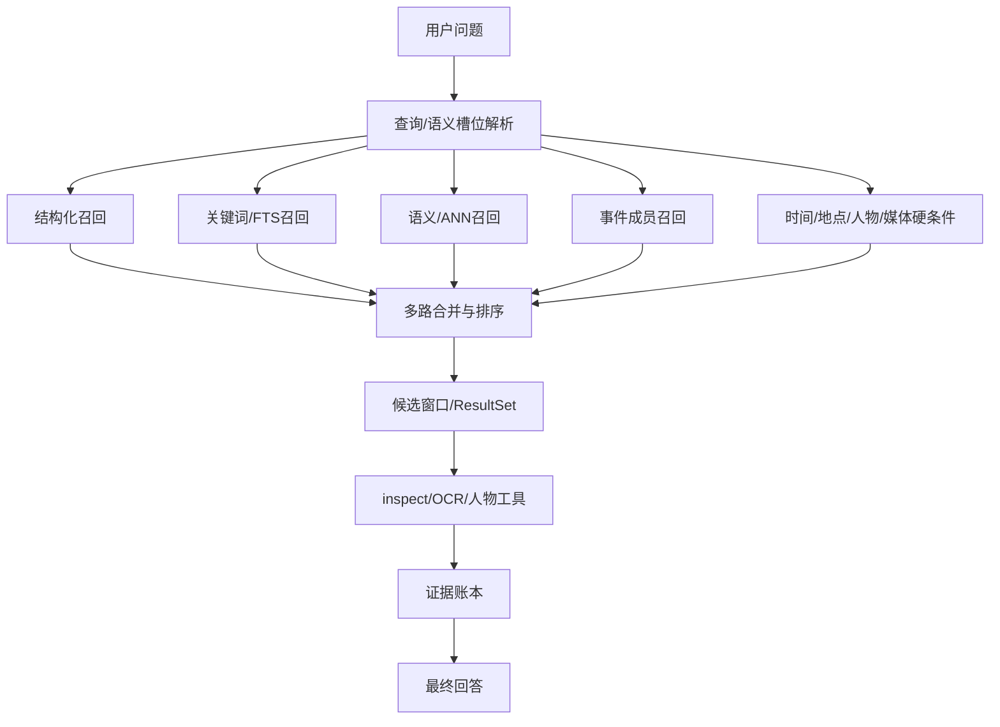

调试时逐层确认：

1. 槽位解析是否丢掉时间、地点、人物或事件；
2. 空 query 是否错误地走了语义召回；
3. 结构化通道是否正确执行硬条件；
4. 中文关键词分词和 FTS 索引是否正常；
5. ANN 向量模型、版本和 scope 是否一致；
6. 事件召回是否把“属于事件”误当成“与问题相关”；
7. 合并排序是否让低相关候选挤掉 GT；
8. 预览窗口是否因去重或多样性策略隐藏 GT；
9. ResultSet、preview、inspect 是否来自同一次查询；
10. 证据账本是否记录了回答实际使用的资产。

### 8.2 记忆查询问题定位表

| 问题 | 观察信号 | 定位顺序 |
|---|---|---|
| GT 完全未召回 | Recall@K 为 0 | scope、时间/地点过滤、槽位、各通道原始结果 |
| 原始结果有 GT，预览没有 | retrieved IDs 有 GT，preview 无 GT | 候选窗口、断层截断、事件多样性和 preview 排序 |
| 跨相册串结果 | candidate scope 与题目不同 | scope 传递、缓存 key、ResultSet 归属和数据库条件 |
| 时间题命中错误年份 | time filter 缺失或边界不一致 | 问题时间、槽位 bounds、captured_at、最终过滤条件 |
| 中文检索失效 | lexical 为空、仅 ANN 命中 | 规范化、分词、FTS 刷新和短词处理 |
| 多路结果重复 | duplicate rate 上升 | asset_id 去重、证据合并、视频 keyframe 映射 |
| 检索正确但回答错误 | GT 已在候选和 inspect 中 | 转入视觉、工具或回答综合层，不再调召回 |
| 多轮引用串上下文 | 第二轮引用上一轮错误图片 | result_set_id、翻页规则、scope 和指代解析 |

### 8.3 记忆查询 A/B 调试流程

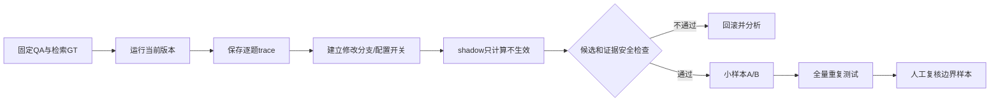

建议一次只改一个变量：先增加 trace 和统计，再改单个召回通道，再改融合排序，最后才调整候选窗口或缓存。所有阶段都保留旧结果，不用新结果覆盖基线。

### 8.4 记忆查询测试集和指标

测试集至少覆盖：结构化事实、时间过滤、地点过滤、人物查询、视觉语义、OCR、多轮引用、空结果/拒答和视频 keyframe。

| 指标 | 定义 |
|---|---|
| Recall@K | 命中的 GT 资产数 / GT 资产总数 |
| Precision@K | 命中的 GT 资产数 / 返回候选数 |
| MRR | 第一个 GT 候选排名倒数的平均值 |
| nDCG@K | 按相关性等级评价排序质量 |
| evidence coverage | 回答所需证据进入候选和证据账本的比例 |
| duplicate rate | 同一资产、视频帧或证据重复出现的比例 |
| contradiction rate | 硬条件过滤后仍存在冲突候选的比例 |
| p50/p95 latency | 只统计检索，不混入模型和 Judge 时延 |

正式 A/B 前建议达到：Recall 不下降，Precision 不下降超过 2 个百分点，evidence coverage ≥ 0.95，duplicate rate ≤ 0.01，检索 p95 不增加 20%。最终门槛应以当前 baseline 和业务要求为准。

## 9. 图关系建立与代码优化调试方法

本节同样只说明调试和验收方法，不直接提交关系图优化代码。

### 9.1 当前关系建立链路

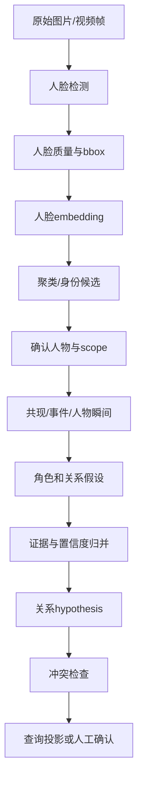

153 重点代码包括 `face_detector.py`、`face_embeddings.py`、`face_clustering.py`、`person_moments.py`、`person_graph.py`、`pipeline.py` 和 `db.py`。

### 9.2 分层调试清单

#### 人脸检测层

- bbox 是否越界、过小、重复或落在错误视频帧；
- 低清、遮挡、侧脸是否标记为低质量；
- 单张图片的人脸数量是否和人工抽样一致；
- 检测模型名称和版本是否记录。

#### embedding 和聚类层

- 向量模型、版本、维度和归一化方式是否一致；
- 阈值改变后分别统计误合并和误拆分；
- 低质量人脸是否形成 bridge；
- 输入顺序改变后 cluster 是否稳定；
- 是否出现异常 singleton 激增。

#### 人物和事件层

- cluster 是否正确映射到 person/entity；
- person、face、asset、observation、event 是否属于同一个 scope；
- interaction target 是否确实出现在同一张图片；
- 视频 keyframe 是否错误继承 parent asset 的人物或事件。

#### 关系边层

- 对称关系是否只保留一条规范边；
- 方向关系的 inverse predicate 是否正确；
- self-loop、未知人物、跨 scope 关系是否被拒绝；
- 每条关系能否追溯到 asset、observation、event 或 moment；
- 重复证据是否被重复计数；
- 家庭关系冲突是否进入人工复核，而不是直接成为 confirmed fact；
- revision、supersedes 和 status 是否能够恢复历史状态。

### 9.3 图关系问题定位表

| 问题 | 典型表现 | 优先检查 |
|---|---|---|
| 两个人合成一个人 | cluster 过大、pairwise precision 下降 | bridge、阈值、pose bucket、embedding 版本 |
| 同一人拆成多人 | pairwise recall 下降、singleton 上升 | 阈值、侧脸/光照、原型覆盖 |
| 关系边重复 | A-B 与 B-A 同时存在 | 对称关系归一、唯一键、重试写入 |
| 关系无证据 | 页面有关系但无法定位照片 | evidence ID、event/moment 绑定、scope |
| 家庭关系过度推断 | 朋友/访客被推成亲属 | 关系门槛、unknown 保留、冲突检查 |
| 新照片未更新 | 全量重跑才出现新边 | 增量触发、受影响 entity/event 计算 |
| 冲突关系同时生效 | 同一对人物有相反关系 | conflict 标记和 confirmed 投影过滤 |

### 9.4 图关系 A/B 调试流程

1. 固定 face detector、embedding 模型和版本，只比较关系构建逻辑；
2. 使用同一批图片和同一批 face instance，避免重新检测干扰结果；
3. 导出旧版和新版 cluster、person mapping、relation edges 及证据 ID；
4. 先比较身份 pairwise 指标，再比较关系边；
5. 按关系类型统计，不用总 F1 掩盖某一类型退化；
6. 对高置信、低置信、冲突、单证据和新增照片分别人工抽样；
7. 先写入 suggested 投影，稳定后才进入 confirmed 查询投影；
8. 保留旧版关系快照，出现误合并时按 revision 回滚。

### 9.5 图关系指标

- 人脸检测 Precision/Recall；
- identity pairwise Precision/Recall/F1；
- cluster singleton ratio、误合并率、误拆分率；
- relation edge Precision/Recall/F1，并按关系类型拆分；
- duplicate edge rate，目标为 0；
- conflict rate；
- evidence traceability，即 confirmed 关系可回溯到原始证据的比例，目标为 1；
- 增量更新耗时与全量重建耗时；
- confirmed 边误报率，优先级高于 suggested 召回率。

## 10. 两部分工作的通用代码调试流程

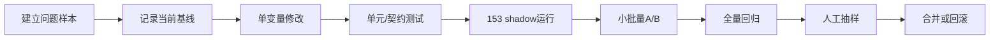

每次代码提交应附带：

- 修改目标和不变条件；
- 受影响的 QA 集合；
- 修改前后指标；
- 失败样本、run ID 和 trace；
- 数据库或索引迁移说明；
- 回滚方式；
- 是否改变模型、提示词、并发或数据版本。

实验结果保存时记录 commit、manifest、scope、模型、Judge 配置和数据版本。账号密码不写入脚本、日志、文档或 Git；原始媒体、数据库和 API Key 只保留在受控机器上。
