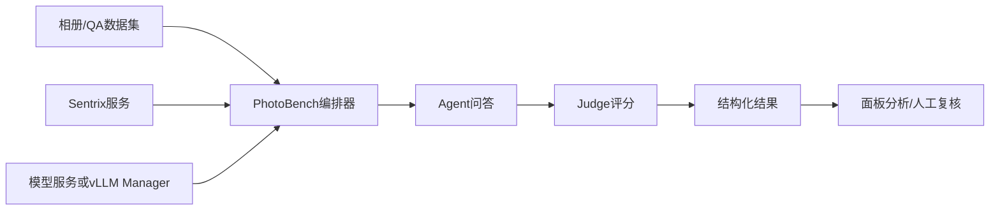
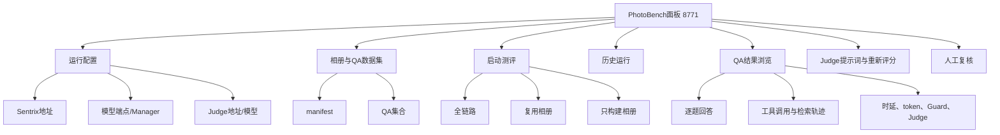
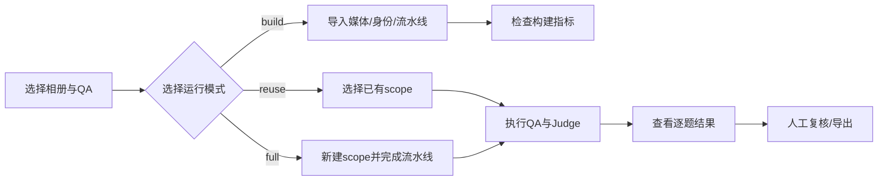
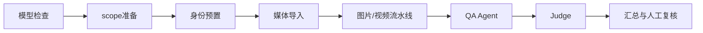

# PhotoBench 测评项目介绍与系统使用说明

## 1. 项目定位

本项目是从 153 机器整合出来的 PhotoBench + Sentrix 端到端测评工程，用于统一管理相册数据、QA 数据集、模型服务、Sentrix 服务、Judge 评分和历史结果。

项目地址：<https://github.com/yuxi1996/sentrix-home-test>

测评面板：<http://192.168.0.153:8771/>

项目只负责测评编排和结果展示，不替代 Sentrix 后端，也不负责模型训练。一次完整测评通常包含：



## 2. 工程目录

| 目录/文件 | 作用 |
|---|---|
| `backend/benchmark_orchestrator.py` | 测评服务入口、运行编排、数据加载、结果保存、Judge 调用和 API |
| `backend/runtime_providers.py` | OpenAI-compatible 模型端点、Manager 和运行时遥测适配 |
| `frontend/src/` | Vue 3 面板源码 |
| `frontend/dist/` | 面板生产构建文件 |
| `config/` | Judge、运行服务和 vLLM 目标配置模板 |
| `data/` | manifest、QA 定义和可提交的数据集元信息；原始媒体不上传 |
| `results/` | 本地历史测评结果，不进入 Git |
| `logs/` | 本地服务日志，不进入 Git |
| `tests/` | 测评编排、图片证据提取、结果契约等回归测试 |
| `scripts/start.sh` / `scripts/stop.sh` | 启停 8771 服务 |

## 3. 面板功能总览

面板的主要功能模块如下：



### 3.1 运行配置

用于填写或检查：

- Sentrix API 地址，153 当前使用 `http://192.168.0.153:8091`；
- 模型服务地址或 vLLM Manager 地址；
- 当前服务模型名称；
- Judge 地址、模型和提供商配置；
- 模型切换、GPU 采样和运行时状态。

生产测评应使用模型 Manager 进行受控冷切换。若直接使用一个外部 OpenAI-compatible 端点，应明确记录没有 Manager 生命周期和硬件遥测，不能把 `not_applicable` 当作测评失败。

### 3.2 相册和 QA 数据集

面板从 manifest 读取相册信息，从 QA JSONL 读取问题、参考答案、检索 GT、人物引用、事件和多轮对话信息。选择相册后，应确认：

1. QA 集合名称正确；
2. 题目数量与 manifest 记录一致；
3. 媒体路径可由 Sentrix 解析；
4. 检索 GT 的媒体 ID 与当前相册一致；
5. 多轮题目的 turn 顺序没有变化。

### 3.3 三种运行模式

| 模式 | 用途 | 是否新建相册 | 是否导入/处理媒体 | 是否执行 QA |
|---|---|---:|---:|---:|
| 全链路测试 `full` | 验证从建库到回答的完整流程 | 是 | 是 | 是 |
| 复用相册 `reuse` | 固定已有相册，专门比较模型或 Agent | 否 | 否 | 是 |
| 构建相册 `build` | 只验证导入、索引、身份和流水线 | 是 | 是 | 否 |

推荐使用顺序：先 `build` 验证数据入库，再 `reuse` 做模型/架构 A/B，最后用 `full` 验证完整交付链路。



## 4. 推荐的面板操作流程

### 步骤一：检查服务

浏览器打开：

```text
http://192.168.0.153:8771/
```

命令行检查：

```bash
curl http://192.168.0.153:8771/api/manifests
curl http://192.168.0.153:8771/api/health
```

如果面板能打开但模型列表为空，先检查模型服务地址、Manager 地址和网络连通性，不要直接启动正式测评。

### 步骤二：选择数据集

优先从已有 manifest 选择相册和 QA 集合。153 当前常用数据规模如下：

| 相册/数据集 | QA 集合或数量 |
|---|---|
| `album3` | compact 10、full 38、behavior 6、paraphrase 88、OCR 8 |
| `album3-14` | compact 10、behavior 6 |
| `album3-kling` | compact 10、full 38、behavior 6、paraphrase 88、OCR 8 |
| `album3-max` | 总计 100；answerable 70、clarify 11、refuse 19 |
| `album3-max-video10` | image-related 439、single-video 48、mixed 487 |

也可以直接查看 QA API：

```bash
curl 'http://192.168.0.153:8771/api/qa-dataset?album_id=album3&qa_set=compact'
```

### 步骤三：启动运行

启动前固定并记录：

- 模型名称和量化方式；
- Sentrix 地址和版本；
- Judge 地址、模型和提示词版本；
- 相册、QA 集合、运行模式；
- Agent/Judge 并发；
- 是否复用已有 scope；
- 是否删除构建产物。

同一组 A/B 测试只能改变一个变量。例如比较记忆查询架构时，模型、相册、QA、Judge、并发和 scope 都要保持不变。

### 步骤四：查看运行阶段

运行阶段通常包括：



阶段异常时先看结构化阶段状态和错误详情，再看日志。日志只用于定位服务异常，不能用日志文本推测缺失的评测指标。

### 步骤五：查看结果

结果页面建议按以下顺序查看：

1. 总体完成数和失败数；
2. exact/core/Judge 质量；
3. 检索 Recall、Precision、F1 和 GT 命中；
4. JSON 解析、任务判断、预算内完成率；
5. TTFT、模型总时延、token/s、工具耗时和端到端耗时；
6. Agent 状态、终止原因、Guard 恢复；
7. 逐题回答、工具调用、检索预览、证据账本；
8. 人工复核 verdict 和备注。

历史结果通过分页加载：

```text
GET /api/runs
GET /api/runs/{run_id}
GET /api/runs/{run_id}/items?page=1&page_size=20
GET /api/runs/{run_id}/items/{index}
GET /api/runs/{run_id}/judge-prompt
GET/POST /api/runs/{run_id}/reviews
```

逐题查看时重点确认“检索到的资产”与“回答引用的证据”是否一致，不能只看最终文字是否通顺。

## 5. 153 数据访问方式

153 上已核对存在的目录：

```text
/home/asus/Github/Sentrix-Home-Web/services/photobench/data
/home/asus/album3-max
/home/asus/photobench-e2e
/home/asus/benchmarks
/home/asus/sentrix-benchmarks/photobench-face-ab-20260823
/home/asus/data/photobench-face-ab-20260823
/home/asus/data/photobench-validation-1184
/home/asus/data/household-benchmark-max
```

SSH 访问：

```bash
ssh asus@192.168.0.153
cd /home/asus/Github/Sentrix-Home-Web/services/photobench
find data -maxdepth 2 -type f
```

账号密码只通过安全渠道提供，不写入本文、配置文件或 Git。原始照片、视频、数据库和 API Key 不应上传到公开仓库。

## 6. 当前 153 基线记录

已核对的 153 运行基线：

- run：`20260831-141104-album3-14-gemma4-12b-it-reuse-0e0886`；
- 10/10 完成，Judge 10 条有效；
- answer quality `1.0/2`，exact `0.4`，core `0.6`；
- retrieval Precision/Recall/F1：`0.710 / 0.880 / 0.786`；
- task decision `0.800`，JSON parse `0.929`，within steps `1.000`；
- TTFT `573.9 ms`，token/s `17.5`，E2E mean `66.5 s`；
- agent throughput `0.128 QA/s`，平均 loop `6.4`；
- 工具 p50：`search_memories 11.6 s`、`inspect_photo 4.29 s`、`query_photo_people 10 ms`。

以上是已有实测记录，不代表后续架构优化已经在 153 生效。

## 7. 常见问题处理

| 现象 | 优先检查 |
|---|---|
| 面板打不开 | 8771 进程、端口、防火墙、浏览器访问地址 |
| 相册为空 | manifest 路径、Sentrix 地址、scope 权限 |
| QA 数量不一致 | QA 集合、JSONL、manifest、题目过滤条件 |
| 模型列表为空 | Manager 地址、模型服务 `/v1/models`、网络 |
| 全部题目失败 | Sentrix 健康状态、模型端点、Judge 地址、请求超时 |
| 检索命中但回答错误 | 逐题查看 candidate、preview、inspect、证据账本和回答引用 |
| Judge 无结果 | Judge 服务、API 配置、并发限制和提示词版本 |
| 时延异常 | 区分模型、工具、流水线和 Judge 时延，不用总墙钟替代分项数据 |
