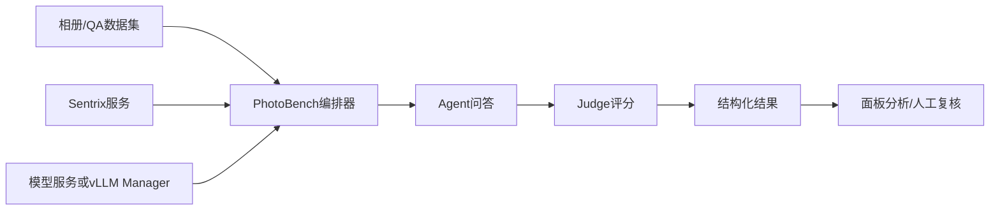
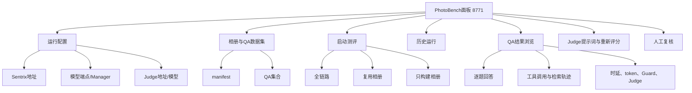
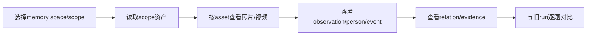
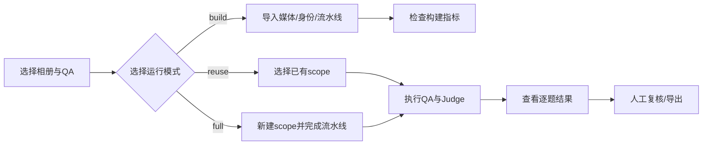
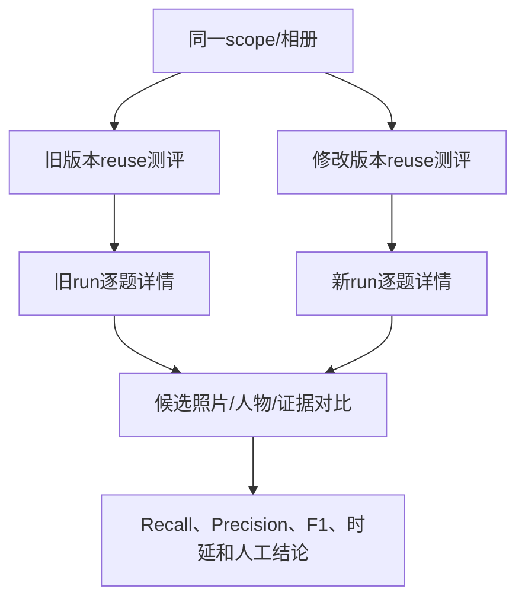
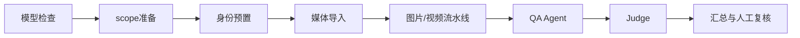
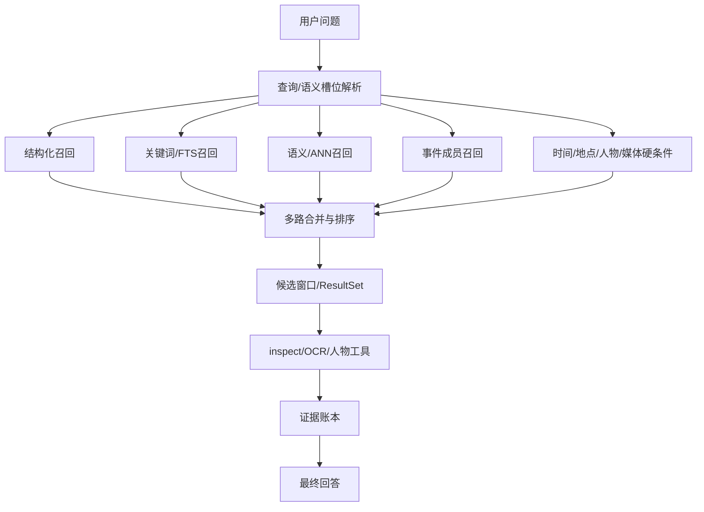
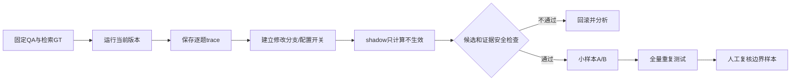
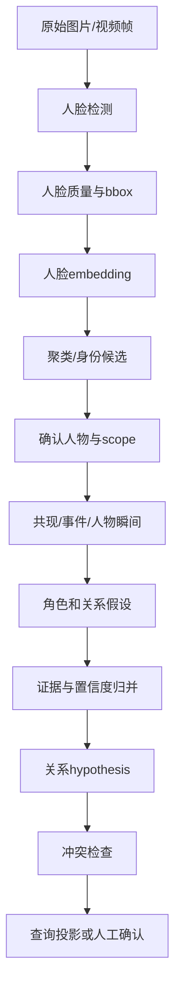
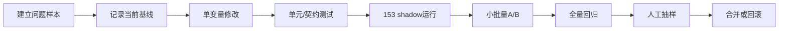

# PhotoBench 测评项目介绍与系统使用说明

## 1. 项目定位

本项目是从 153 机器整合出来的 PhotoBench + Sentrix 端到端测评工程，用于统一管理相册数据、QA 数据集、模型服务、Sentrix 服务、Judge 评分和历史结果。

项目地址：<https://github.com/yuxi1996/sentrix-home-test>

测评面板：<http://192.168.0.153:8771/>

项目只负责测评编排和结果展示，不替代 Sentrix 后端，也不负责模型训练。一次完整测评通常包含：



## 2. 工程目录

| 目录/文件 | 作用 |
|---|---|
| `backend/benchmark_orchestrator.py` | 测评服务入口、运行编排、数据加载、结果保存、Judge 调用和 API |
| `backend/runtime_providers.py` | OpenAI-compatible 模型端点、Manager 和运行时遥测适配 |
| `frontend/src/` | Vue 3 面板源码 |
| `frontend/dist/` | 面板生产构建文件 |
| `config/` | Judge、运行服务和 vLLM 目标配置模板 |
| `data/` | manifest、QA 定义和可提交的数据集元信息；原始媒体不上传 |
| `results/` | 本地历史测评结果，不进入 Git |
| `logs/` | 本地服务日志，不进入 Git |
| `tests/` | 测评编排、图片证据提取、结果契约等回归测试 |
| `scripts/start.sh` / `scripts/stop.sh` | 启停 8771 服务 |

## 3. 面板功能总览

面板的主要功能模块如下：



### 3.1.1 记忆相册查看能力说明

记忆查询和图关系优化的效果必须能回到具体照片、人物和证据上查看。目前面板提供以下查看路径：

| 查看内容 | 当前入口 | 说明 |
|---|---|---|
| 相册是否已经构建 | 构建相册、复用相册 | 查看已有 memory space/scope 和处理状态 |
| QA 对照照片 | QA 数据集审阅 | 查看题目的检索 GT、直接证据和视频证据 |
| 实际检索结果 | 历史运行 → 逐题详情 | 查看 retrieved media、preview、predicted/evidence media |
| 检索过程 | 历史运行 → 工具调用/检索轨迹 | 查看 query、候选、工具顺序、证据账本和耗时 |
| 人物/关系效果 | 逐题人物引用、Sentrix 资产数据和关系查询 | 当前没有独立的关系图可视化页面，需要按 scope/API 核验 |

需要特别说明：当前版本还没有独立的“记忆相册浏览器”页面。也就是说，可以查看 QA 证据和测评实际使用的照片，但不能像图库一样在一个页面中按 scope 浏览所有照片、人物、事件和关系。若要观察记忆查询或图关系优化效果，应使用下面的 scope 资产查看方式，并结合逐题结果比较。



### 3.1 运行配置

用于填写或检查：

- Sentrix API 地址，153 当前使用 `http://192.168.0.153:8091`；
- 模型服务地址或 vLLM Manager 地址；
- 当前服务模型名称；
- Judge 地址、模型和提供商配置；
- 模型切换、GPU 采样和运行时状态。

生产测评应使用模型 Manager 进行受控冷切换。若直接使用一个外部 OpenAI-compatible 端点，应明确记录没有 Manager 生命周期和硬件遥测，不能把 `not_applicable` 当作测评失败。

### 3.2 相册和 QA 数据集

面板从 manifest 读取相册信息，从 QA JSONL 读取问题、参考答案、检索 GT、人物引用、事件和多轮对话信息。选择相册后，应确认：

1. QA 集合名称正确；
2. 题目数量与 manifest 记录一致；
3. 媒体路径可由 Sentrix 解析；
4. 检索 GT 的媒体 ID 与当前相册一致；
5. 多轮题目的 turn 顺序没有变化。

### 3.3 三种运行模式

| 模式 | 用途 | 是否新建相册 | 是否导入/处理媒体 | 是否执行 QA |
|---|---|---:|---:|---:|
| 全链路测试 `full` | 验证从建库到回答的完整流程 | 是 | 是 | 是 |
| 复用相册 `reuse` | 固定已有相册，专门比较模型或 Agent | 否 | 否 | 是 |
| 构建相册 `build` | 只验证导入、索引、身份和流水线 | 是 | 是 | 否 |

推荐使用顺序：先 `build` 验证数据入库，再 `reuse` 做模型/架构 A/B，最后用 `full` 验证完整交付链路。



## 4. 推荐的面板操作流程

### 步骤一：检查服务

浏览器打开：

```text
http://192.168.0.153:8771/
```

命令行检查：

```bash
curl http://192.168.0.153:8771/api/manifests
curl http://192.168.0.153:8771/api/health
```

如果面板能打开但模型列表为空，先检查模型服务地址、Manager 地址和网络连通性，不要直接启动正式测评。

### 步骤二：选择数据集

优先从已有 manifest 选择相册和 QA 集合。153 当前常用数据规模如下：

| 相册/数据集 | QA 集合或数量 |
|---|---|
| `album3` | compact 10、full 38、behavior 6、paraphrase 88、OCR 8 |
| `album3-14` | compact 10、behavior 6 |
| `album3-kling` | compact 10、full 38、behavior 6、paraphrase 88、OCR 8 |
| `album3-max` | 总计 100；answerable 70、clarify 11、refuse 19 |
| `album3-max-video10` | image-related 439、single-video 48、mixed 487 |

也可以直接查看 QA API：

```bash
curl 'http://192.168.0.153:8771/api/qa-dataset?album_id=album3&qa_set=compact'
```

### 4.2 如何查看记忆相册和实际入库资产

先在面板的“复用相册”中加载已有 memory space，记录 `scope_id`。也可以通过接口获取 scope 列表：

```bash
curl 'http://192.168.0.153:8091/api/memory-spaces?limit=1000'
```

再查询该 scope 的资产：

```bash
curl 'http://192.168.0.153:8091/api/assets?scope_id=<SCOPE_ID>&limit=2000'
```

单个照片或视频资产可通过返回的 `asset.id` 查看：

```text
http://192.168.0.153:8091/api/assets/<ASSET_ID>/file
```

查看优化效果时，至少保存以下字段：

- `asset_id`、`file_name`、`media_type`、`captured_at`；
- observation 的描述、地点、人物和事件引用；
- 人脸实例、person/entity、cluster 的映射；
- 关系边的 subject、predicate、object、status、confidence 和 evidence；
- 查询返回的 retrieved asset、preview asset、evidence asset；
- 新旧 run 的 query、scope、候选排名和最终回答。

### 4.3 如何通过面板看出优化前后差异

使用同一相册和同一 QA 集合分别运行旧版本和修改版本，推荐使用“复用相册”模式，避免重复导入和流水线处理：



逐题对比顺序：

1. 先对比 GT 是否进入 retrieved asset；
2. 再对比 preview 是否展示正确照片；
3. 再对比 inspect/OCR/人物工具是否使用了正确 asset handle；
4. 再对比证据账本是否引用同一批照片；
5. 图关系题再对比人物 cluster、关系边和 evidence ID；
6. 最后对比最终回答、Judge、时延和 token。

如果只看最终分数而不看照片和证据，无法判断优化究竟改善了召回、排序、人物识别还是回答生成。

### 步骤三：启动运行

启动前固定并记录：

- 模型名称和量化方式；
- Sentrix 地址和版本；
- Judge 地址、模型和提示词版本；
- 相册、QA 集合、运行模式；
- Agent/Judge 并发；
- 是否复用已有 scope；
- 是否删除构建产物。

同一组 A/B 测试只能改变一个变量。例如比较记忆查询架构时，模型、相册、QA、Judge、并发和 scope 都要保持不变。

### 步骤四：查看运行阶段

运行阶段通常包括：



阶段异常时先看结构化阶段状态和错误详情，再看日志。日志只用于定位服务异常，不能用日志文本推测缺失的评测指标。

### 步骤五：查看结果

结果页面建议按以下顺序查看：

1. 总体完成数和失败数；
2. exact/core/Judge 质量；
3. 检索 Recall、Precision、F1 和 GT 命中；
4. JSON 解析、任务判断、预算内完成率；
5. TTFT、模型总时延、token/s、工具耗时和端到端耗时；
6. Agent 状态、终止原因、Guard 恢复；
7. 逐题回答、工具调用、检索预览、证据账本；
8. 人工复核 verdict 和备注。

历史结果通过分页加载：

```text
GET /api/runs
GET /api/runs/{run_id}
GET /api/runs/{run_id}/items?page=1&page_size=20
GET /api/runs/{run_id}/items/{index}
GET /api/runs/{run_id}/judge-prompt
GET/POST /api/runs/{run_id}/reviews
```

逐题查看时重点确认“检索到的资产”与“回答引用的证据”是否一致，不能只看最终文字是否通顺。

## 5. 153 数据访问方式

153 上已核对存在的目录：

```text
/home/asus/Github/Sentrix-Home-Web/services/photobench/data
/home/asus/album3-max
/home/asus/photobench-e2e
/home/asus/benchmarks
/home/asus/sentrix-benchmarks/photobench-face-ab-20260823
/home/asus/data/photobench-face-ab-20260823
/home/asus/data/photobench-validation-1184
/home/asus/data/household-benchmark-max
```

SSH 访问：

```bash
ssh asus@192.168.0.153
cd /home/asus/Github/Sentrix-Home-Web/services/photobench
find data -maxdepth 2 -type f
```

账号密码只通过安全渠道提供，不写入本文、配置文件或 Git。原始照片、视频、数据库和 API Key 不应上传到公开仓库。

## 6. 当前 153 基线记录

已核对的 153 运行基线：

- run：`20260831-141104-album3-14-gemma4-12b-it-reuse-0e0886`；
- 10/10 完成，Judge 10 条有效；
- answer quality `1.0/2`，exact `0.4`，core `0.6`；
- retrieval Precision/Recall/F1：`0.710 / 0.880 / 0.786`；
- task decision `0.800`，JSON parse `0.929`，within steps `1.000`；
- TTFT `573.9 ms`，token/s `17.5`，E2E mean `66.5 s`；
- agent throughput `0.128 QA/s`，平均 loop `6.4`；
- 工具 p50：`search_memories 11.6 s`、`inspect_photo 4.29 s`、`query_photo_people 10 ms`。

以上是已有实测记录，不代表后续架构优化已经在 153 生效。

## 7. 常见问题处理

| 现象 | 优先检查 |
|---|---|
| 面板打不开 | 8771 进程、端口、防火墙、浏览器访问地址 |
| 相册为空 | manifest 路径、Sentrix 地址、scope 权限 |
| QA 数量不一致 | QA 集合、JSONL、manifest、题目过滤条件 |
| 模型列表为空 | Manager 地址、模型服务 `/v1/models`、网络 |
| 全部题目失败 | Sentrix 健康状态、模型端点、Judge 地址、请求超时 |
| 检索命中但回答错误 | 逐题查看 candidate、preview、inspect、证据账本和回答引用 |
| Judge 无结果 | Judge 服务、API 配置、并发限制和提示词版本 |
| 时延异常 | 区分模型、工具、流水线和 Judge 时延，不用总墙钟替代分项数据 |

## 8. 记忆查询架构与代码优化调试方法

本节说明如何分析、修改、调试和验收记忆查询代码，不直接提供优化实现代码。适用于 153 上的 Sentrix 工程和本仓库的 PhotoBench 测评。

### 8.1 当前记忆查询链路

153 当前 `search_memories` 的主要逻辑如下：



调试时逐层确认：

1. 槽位解析是否丢掉时间、地点、人物或事件；
2. 空 query 是否错误地走了语义召回；
3. 结构化通道是否正确执行硬条件；
4. 中文关键词分词和 FTS 索引是否正常；
5. ANN 向量模型、版本和 scope 是否一致；
6. 事件召回是否把“属于事件”误当成“与问题相关”；
7. 合并排序是否让低相关候选挤掉 GT；
8. 预览窗口是否因去重或多样性策略隐藏 GT；
9. ResultSet、preview、inspect 是否来自同一次查询；
10. 证据账本是否记录了回答实际使用的资产。

### 8.2 记忆查询问题定位表

| 问题 | 观察信号 | 定位顺序 |
|---|---|---|
| GT 完全未召回 | Recall@K 为 0 | scope、时间/地点过滤、槽位、各通道原始结果 |
| 原始结果有 GT，预览没有 | retrieved IDs 有 GT，preview 无 GT | 候选窗口、断层截断、事件多样性和 preview 排序 |
| 跨相册串结果 | candidate scope 与题目不同 | scope 传递、缓存 key、ResultSet 归属和数据库条件 |
| 时间题命中错误年份 | time filter 缺失或边界不一致 | 问题时间、槽位 bounds、captured_at、最终过滤条件 |
| 中文检索失效 | lexical 为空、仅 ANN 命中 | 规范化、分词、FTS 刷新和短词处理 |
| 多路结果重复 | duplicate rate 上升 | asset_id 去重、证据合并、视频 keyframe 映射 |
| 检索正确但回答错误 | GT 已在候选和 inspect 中 | 转入视觉、工具或回答综合层，不再调召回 |
| 多轮引用串上下文 | 第二轮引用上一轮错误图片 | result_set_id、翻页规则、scope 和指代解析 |

### 8.3 记忆查询 A/B 调试流程



建议一次只改一个变量：先增加 trace 和统计，再改单个召回通道，再改融合排序，最后才调整候选窗口或缓存。所有阶段都保留旧结果，不用新结果覆盖基线。

### 8.4 记忆查询测试集和指标

测试集至少覆盖：结构化事实、时间过滤、地点过滤、人物查询、视觉语义、OCR、多轮引用、空结果/拒答和视频 keyframe。

| 指标 | 定义 |
|---|---|
| Recall@K | 命中的 GT 资产数 / GT 资产总数 |
| Precision@K | 命中的 GT 资产数 / 返回候选数 |
| MRR | 第一个 GT 候选排名倒数的平均值 |
| nDCG@K | 按相关性等级评价排序质量 |
| evidence coverage | 回答所需证据进入候选和证据账本的比例 |
| duplicate rate | 同一资产、视频帧或证据重复出现的比例 |
| contradiction rate | 硬条件过滤后仍存在冲突候选的比例 |
| p50/p95 latency | 只统计检索，不混入模型和 Judge 时延 |

正式 A/B 前建议达到：Recall 不下降，Precision 不下降超过 2 个百分点，evidence coverage ≥ 0.95，duplicate rate ≤ 0.01，检索 p95 不增加 20%。最终门槛应以当前 baseline 和业务要求为准。

## 9. 图关系建立与代码优化调试方法

本节同样只说明调试和验收方法，不直接提交关系图优化代码。

### 9.1 当前关系建立链路



153 重点代码包括 `face_detector.py`、`face_embeddings.py`、`face_clustering.py`、`person_moments.py`、`person_graph.py`、`pipeline.py` 和 `db.py`。

### 9.2 分层调试清单

#### 人脸检测层

- bbox 是否越界、过小、重复或落在错误视频帧；
- 低清、遮挡、侧脸是否标记为低质量；
- 单张图片的人脸数量是否和人工抽样一致；
- 检测模型名称和版本是否记录。

#### embedding 和聚类层

- 向量模型、版本、维度和归一化方式是否一致；
- 阈值改变后分别统计误合并和误拆分；
- 低质量人脸是否形成 bridge；
- 输入顺序改变后 cluster 是否稳定；
- 是否出现异常 singleton 激增。

#### 人物和事件层

- cluster 是否正确映射到 person/entity；
- person、face、asset、observation、event 是否属于同一个 scope；
- interaction target 是否确实出现在同一张图片；
- 视频 keyframe 是否错误继承 parent asset 的人物或事件。

#### 关系边层

- 对称关系是否只保留一条规范边；
- 方向关系的 inverse predicate 是否正确；
- self-loop、未知人物、跨 scope 关系是否被拒绝；
- 每条关系能否追溯到 asset、observation、event 或 moment；
- 重复证据是否被重复计数；
- 家庭关系冲突是否进入人工复核，而不是直接成为 confirmed fact；
- revision、supersedes 和 status 是否能够恢复历史状态。

### 9.3 图关系问题定位表

| 问题 | 典型表现 | 优先检查 |
|---|---|---|
| 两个人合成一个人 | cluster 过大、pairwise precision 下降 | bridge、阈值、pose bucket、embedding 版本 |
| 同一人拆成多人 | pairwise recall 下降、singleton 上升 | 阈值、侧脸/光照、原型覆盖 |
| 关系边重复 | A-B 与 B-A 同时存在 | 对称关系归一、唯一键、重试写入 |
| 关系无证据 | 页面有关系但无法定位照片 | evidence ID、event/moment 绑定、scope |
| 家庭关系过度推断 | 朋友/访客被推成亲属 | 关系门槛、unknown 保留、冲突检查 |
| 新照片未更新 | 全量重跑才出现新边 | 增量触发、受影响 entity/event 计算 |
| 冲突关系同时生效 | 同一对人物有相反关系 | conflict 标记和 confirmed 投影过滤 |

### 9.4 图关系 A/B 调试流程

1. 固定 face detector、embedding 模型和版本，只比较关系构建逻辑；
2. 使用同一批图片和同一批 face instance，避免重新检测干扰结果；
3. 导出旧版和新版 cluster、person mapping、relation edges 及证据 ID；
4. 先比较身份 pairwise 指标，再比较关系边；
5. 按关系类型统计，不用总 F1 掩盖某一类型退化；
6. 对高置信、低置信、冲突、单证据和新增照片分别人工抽样；
7. 先写入 suggested 投影，稳定后才进入 confirmed 查询投影；
8. 保留旧版关系快照，出现误合并时按 revision 回滚。

### 9.5 图关系指标

- 人脸检测 Precision/Recall；
- identity pairwise Precision/Recall/F1；
- cluster singleton ratio、误合并率、误拆分率；
- relation edge Precision/Recall/F1，并按关系类型拆分；
- duplicate edge rate，目标为 0；
- conflict rate；
- evidence traceability，即 confirmed 关系可回溯到原始证据的比例，目标为 1；
- 增量更新耗时与全量重建耗时；
- confirmed 边误报率，优先级高于 suggested 召回率。

## 10. 两部分工作的通用代码调试流程



每次代码提交应附带：

- 修改目标和不变条件；
- 受影响的 QA 集合；
- 修改前后指标；
- 失败样本、run ID 和 trace；
- 数据库或索引迁移说明；
- 回滚方式；
- 是否改变模型、提示词、并发或数据版本。

实验结果保存时记录 commit、manifest、scope、模型、Judge 配置和数据版本。账号密码不写入脚本、日志、文档或 Git；原始媒体、数据库和 API Key 只保留在受控机器上。
